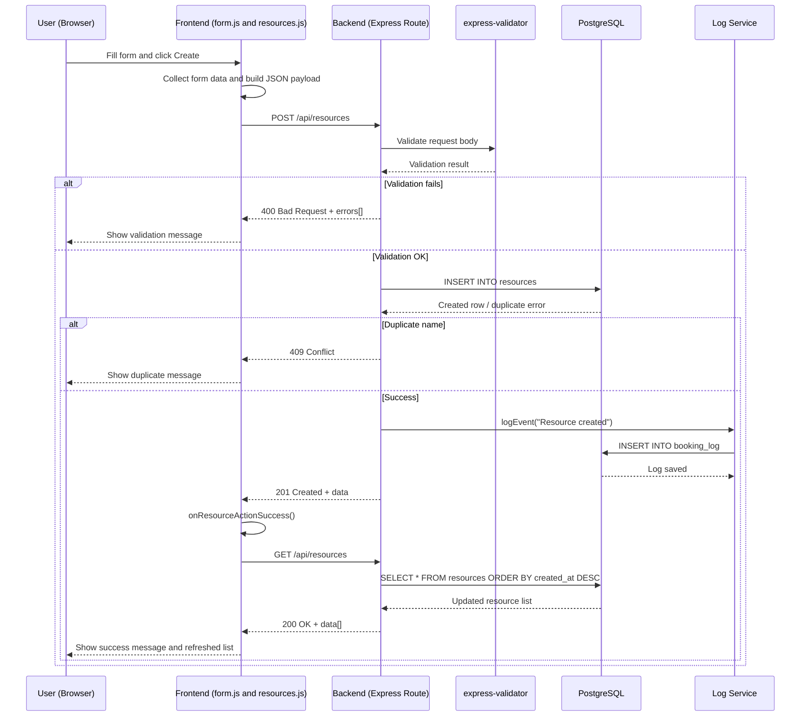
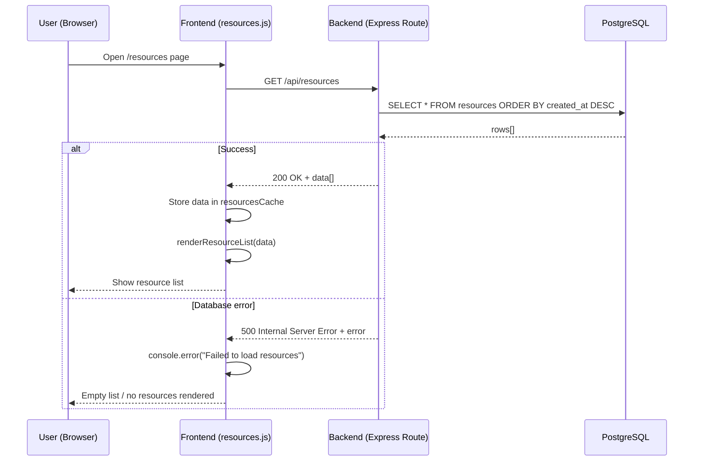
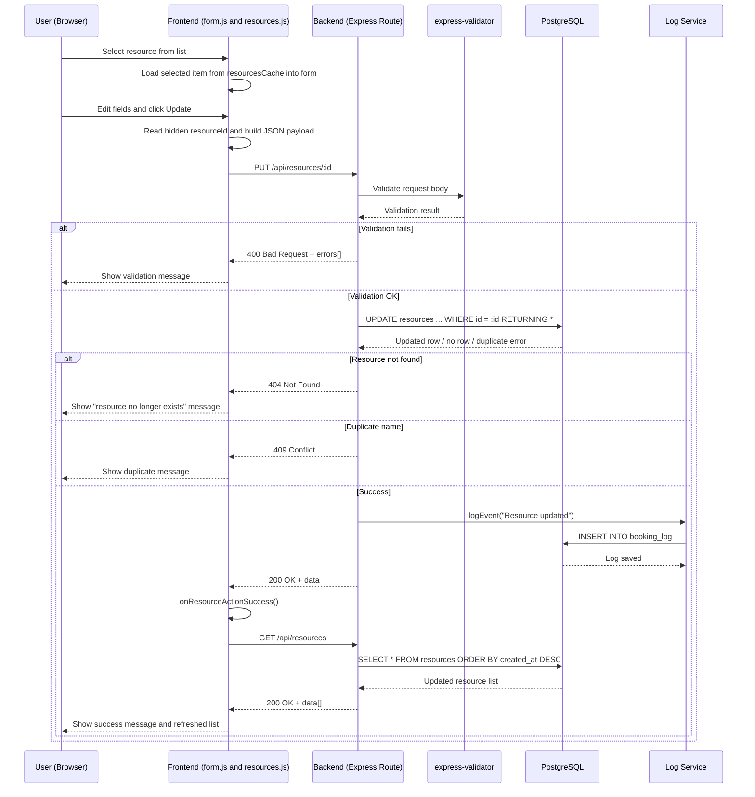
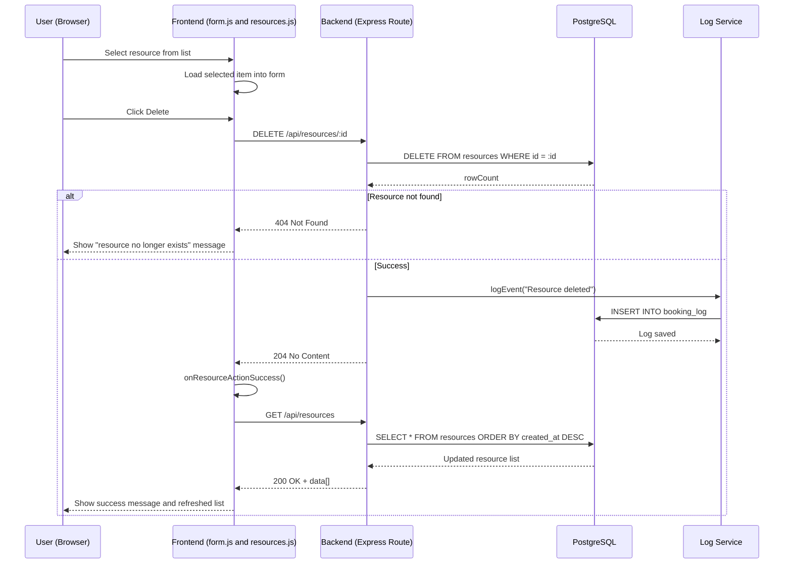

# CREATE

```mermaid
sequenceDiagram
    participant U as User (Browser)
    participant F as Frontend (form.js and resources.js)
    participant B as Backend (Express Route)
    participant V as express-validator
    participant DB as PostgreSQL
    participant L as Log Service

    U->>F: Fill form and click Create
    F->>F: Collect form data and build JSON payload
    F->>B: POST /api/resources
    B->>V: Validate request body
    V-->>B: Validation result

    alt Validation fails
        B-->>F: 400 Bad Request + errors[]
        F-->>U: Show validation message
    else Validation OK
        B->>DB: INSERT INTO resources
        DB-->>B: Created row / duplicate error

        alt Duplicate name
            B-->>F: 409 Conflict
            F-->>U: Show duplicate message
        else Success
            B->>L: logEvent("Resource created")
            L->>DB: INSERT INTO booking_log
            DB-->>L: Log saved
            B-->>F: 201 Created + data
            F->>F: onResourceActionSuccess()
            F->>B: GET /api/resources
            B->>DB: SELECT * FROM resources ORDER BY created_at DESC
            DB-->>B: Updated resource list
            B-->>F: 200 OK + data[]
            F-->>U: Show success message and refreshed list
        end
    end
```

# READ

```mermaid
sequenceDiagram
    participant U as User (Browser)
    participant F as Frontend (resources.js)
    participant B as Backend (Express Route)
    participant DB as PostgreSQL

    U->>F: Open /resources page
    F->>B: GET /api/resources
    B->>DB: SELECT * FROM resources ORDER BY created_at DESC
    DB-->>B: rows[]

    alt Success
        B-->>F: 200 OK + data[]
        F->>F: Store data in resourcesCache
        F->>F: renderResourceList(data)
        F-->>U: Show resource list
    else Database error
        B-->>F: 500 Internal Server Error + error
        F->>F: console.error("Failed to load resources")
        F-->>U: Empty list / no resources rendered
    end
```

# UPDATE

```mermaid
sequenceDiagram
    participant U as User (Browser)
    participant F as Frontend (form.js and resources.js)
    participant B as Backend (Express Route)
    participant V as express-validator
    participant DB as PostgreSQL
    participant L as Log Service

    U->>F: Select resource from list
    F->>F: Load selected item from resourcesCache into form
    U->>F: Edit fields and click Update
    F->>F: Read hidden resourceId and build JSON payload
    F->>B: PUT /api/resources/:id
    B->>V: Validate request body
    V-->>B: Validation result

    alt Validation fails
        B-->>F: 400 Bad Request + errors[]
        F-->>U: Show validation message
    else Validation OK
        B->>DB: UPDATE resources ... WHERE id = :id RETURNING *
        DB-->>B: Updated row / no row / duplicate error

        alt Resource not found
            B-->>F: 404 Not Found
            F-->>U: Show "resource no longer exists" message
        else Duplicate name
            B-->>F: 409 Conflict
            F-->>U: Show duplicate message
        else Success
            B->>L: logEvent("Resource updated")
            L->>DB: INSERT INTO booking_log
            DB-->>L: Log saved
            B-->>F: 200 OK + data
            F->>F: onResourceActionSuccess()
            F->>B: GET /api/resources
            B->>DB: SELECT * FROM resources ORDER BY created_at DESC
            DB-->>B: Updated resource list
            B-->>F: 200 OK + data[]
            F-->>U: Show success message and refreshed list
        end
    end
```

# DELETE

```mermaid
sequenceDiagram
    participant U as User (Browser)
    participant F as Frontend (form.js and resources.js)
    participant B as Backend (Express Route)
    participant DB as PostgreSQL
    participant L as Log Service

    U->>F: Select resource from list
    F->>F: Load selected item into form
    U->>F: Click Delete
    F->>B: DELETE /api/resources/:id
    B->>DB: DELETE FROM resources WHERE id = :id
    DB-->>B: rowCount

    alt Resource not found
        B-->>F: 404 Not Found
        F-->>U: Show "resource no longer exists" message
    else Success
        B->>L: logEvent("Resource deleted")
        L->>DB: INSERT INTO booking_log
        DB-->>L: Log saved
        B-->>F: 204 No Content
        F->>F: onResourceActionSuccess()
        F->>B: GET /api/resources
        B->>DB: SELECT * FROM resources ORDER BY created_at DESC
        DB-->>B: Updated resource list
        B-->>F: 200 OK + data[]
        F-->>U: Show success message and refreshed list
    end
```